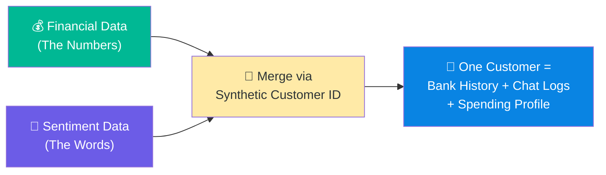
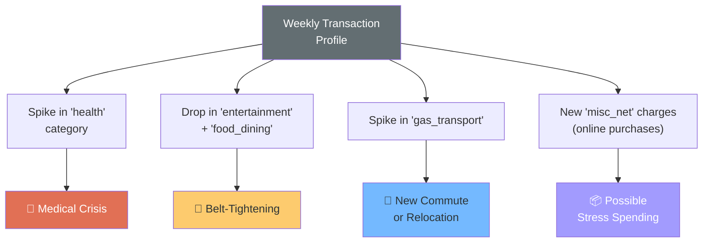
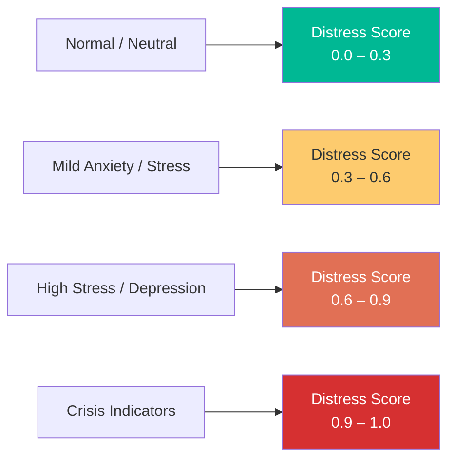
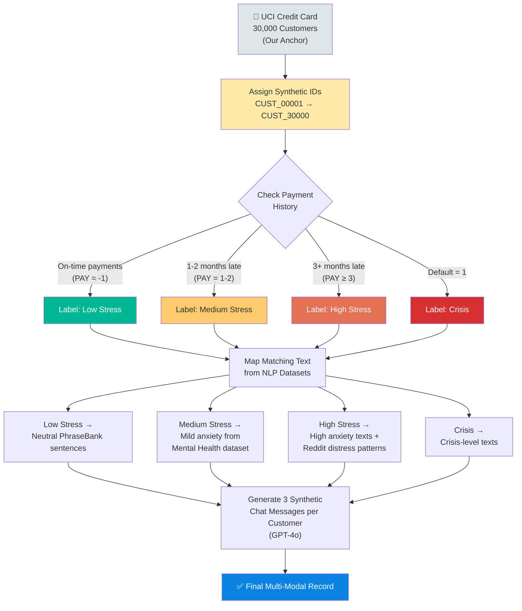
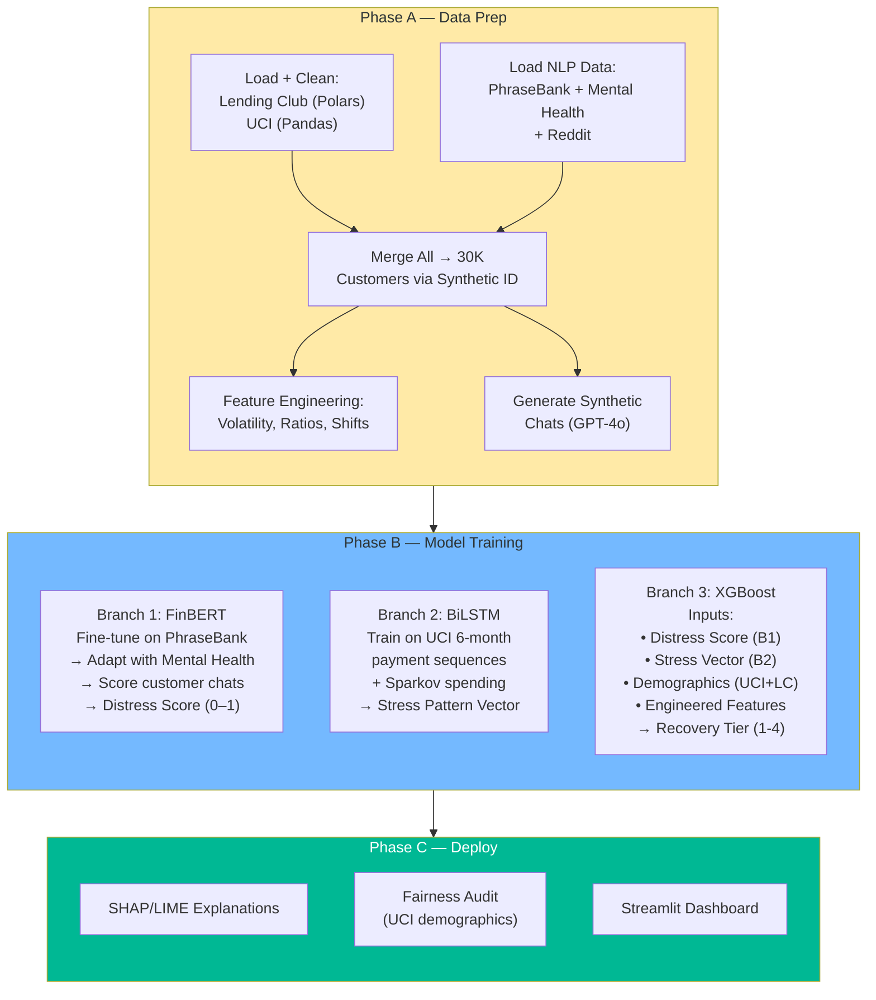

# 🧠 SBDR — Dataset Strategy (Updated)

  

> **Last Updated:** February 12, 2026

> **Status:** Ready for Execution

> **Hardware:** Mac Pro M3 Pro | 24GB Unified Memory | PyTorch `mps`

  

---

  

## Why a "Hybrid Data Strategy"?

  

Here's the thing — no single public dataset out there has **both** a customer's bank transactions **and** their emotional state in one place. Real bank chat logs are locked behind PII regulations, and no bank is handing that over to a capstone team.

  

So we're building our own multi-modal dataset by **merging 6 public datasets** into one. The idea is simple: give every customer a financial history (numbers) **and** a communication trail (words), then let our AI connect the dots.

  



  

---

  

## The 6 Datasets We're Using

  

We split our data into two camps — **Financial** (feeds the numbers side of our AI) and **Sentiment/NLP** (feeds the language side). Here's each one, why we picked it, and exactly where it plugs into our pipeline.

  

---

  

### 🏦 Camp 1: Financial Datasets (The "Behavior")

  

These tell us **what the customer is doing** with their money. They feed Branch 2 (BiLSTM) and Branch 3 (XGBoost).

  

---

  

#### Dataset 1: Lending Club Loan Data

  

> [!info] 📦 Dataset Card

> **Link:** [Kaggle — Lending Club](https://www.kaggle.com/datasets/wordsforthewise/lending-club)

> **Size:** ~2.26 million rows × 151 columns

> **Time Range:** 2007–2018

> **Format:** CSV

  

This is our **big picture** dataset. Over 2 million real loan records from Lending Club's peer-to-peer lending platform. Every row is a real person who took out a loan, and we can see exactly what happened — did they pay it back? Did they default? Are they late?

  

**Columns we actually care about:**

- `loan_status` → This is our **gold label**. We map it directly to our 4 Recovery Tiers:

- *Fully Paid / Current* → Tier 1 (Standard Reminder)

- *In Grace Period / Late 16-30 days* → Tier 2 (Soft Assistance)

- *Late 31-120 days* → Tier 3 (Hardship Restructuring)

- *Charged Off / Default* → Tier 4 (Legal Recovery)

- `annual_inc` → Borrower income (helps XGBoost understand financial capacity)

- `dti` → Debt-to-income ratio (high DTI = stretched thin)

- `revol_util` → How maxed out their credit cards are

- `grade` / `sub_grade` → Lending Club's own A1-to-G5 risk grading

- `emp_length` → Employment duration (sudden change could mean job loss)

- `purpose` → Why they took the loan — *"medical"* or *"debt_consolidation"* screams Temporary Hardship

  

**⚠️ RAM Warning:** This dataset is massive. 2.26M rows × 151 columns will eat 4–8GB of RAM if we load it naively with Pandas. We have two options:

1. **Use Polars** (recommended — it's in our tech stack for a reason)

2. **Selective column loading** with Pandas:

```python

cols = ['loan_status', 'annual_inc', 'dti', 'revol_util', 'grade', 'emp_length', 'purpose']

df = pd.read_csv('lending_club.csv', usecols=cols, dtype={'grade': 'category'})

```

  

**When we use it:** Phase A (data prep) for demographic features + tier labeling, and Phase B for XGBoost's static input features.

  

---

  

#### Dataset 2: Default of Credit Card Clients (UCI)

  

> [!info] 📦 Dataset Card

> **Link:** [UCI Repository](https://archive.ics.uci.edu/ml/datasets/default+of+credit+card+clients)

> **Size:** 30,000 records × 25 columns

> **Time Range:** April–September 2005 (6 consecutive months)

> **Format:** XLS / CSV

  

This is the **heartbeat of our project**. It's the only public dataset that gives us **6 sequential months of payment behavior per customer** — which is exactly what our BiLSTM needs to learn time-based patterns.

  

**The columns that matter most:**

- `PAY_0` to `PAY_6` → Repayment status each month (-1 = on time, 1 = 1 month late, 2 = 2 months late...)

- `BILL_AMT1` to `BILL_AMT6` → What they owed each month

- `PAY_AMT1` to `PAY_AMT6` → What they actually paid each month

- `LIMIT_BAL` → Their credit limit

- `AGE`, `SEX`, `EDUCATION`, `MARRIAGE` → Demographics (also used for fairness audits later)

- `default.payment.next.month` → Binary: did they default? (1 = yes)

  

**Why this is our base dataset for merging:**

We use these 30,000 customers as our **anchor population**. Every other dataset gets mapped onto these 30K Customer IDs. Why? Because:

1. It's clean and manageable (30K rows runs in seconds on our M3 Pro)

2. It already has sequential data (perfect for LSTM)

3. It has demographics (needed for bias testing)

  

**What the BiLSTM sees:**

  

We reshape the 6-month data into tensors:

  

```

Shape: (30000, 6, n_features)

↑ ↑ ↑

customers months features per month

```

  

Each "feature per month" includes: payment status, bill amount, payment amount, and engineered ratios.

  

**Features we engineer from this:**

- **Spending Volatility** = `std(BILL_AMT1 : BILL_AMT6)` → High = unstable spending

- **Payment Ratio Trend** = `PAY_AMTn / BILL_AMTn` across 6 months → Declining = growing inability to pay

- **Delinquency Acceleration** = How fast `PAY_0` through `PAY_6` is worsening

  

**When we use it:** Phase A (base for merging + feature engineering), Phase B (primary input for BiLSTM + features for XGBoost), Phase C (demographics for fairness audit).

  

---

  

#### Dataset 3: Sparkov Synthetic Financial Transactions

  

> [!info] 📦 Dataset Card

> **Link:** [Kaggle — Fraud Detection](https://www.kaggle.com/datasets/kartik2112/fraud-detection)

> **Alt Link:** [Kaggle — Transactions](https://www.kaggle.com/datasets/ismetsemedov/transactions)

> **Size:** 1.3M+ training transactions + 550K+ test

> **Format:** CSV

  

This gives us what UCI doesn't — **daily transaction-level granularity with merchant categories**. We can see *what* people are spending on, not just how much.

  

**Columns we use:**

- `amt` → Transaction amount

- `category` → Merchant type (grocery, gas, health, entertainment, etc.)

- `trans_date_trans_time` → Timestamp for building daily/weekly profiles

- `merchant` → Merchant name

  

**The real value — Life Event Detection:**

  

This is where it gets interesting. We aggregate transactions into weekly profiles and look for **category shifts** that signal life events:

  



  

**Heads up:** This data is synthetic (generated by Sparkov Data Science for fraud detection). We're repurposing it. The transaction patterns aren't from real people, but the category-level spending profiles are realistic enough for our feature engineering.

  

**When we use it:** Phase A (feature engineering — Category Shift Index, daily spending volatility), Phase B (supplementary features for XGBoost).

  

---

  

### 💬 Camp 2: NLP & Sentiment Datasets (The "Vibe")

  

These tell us **how the customer feels**. They feed Branch 1 (FinBERT).

  

---

  

#### Dataset 4: Financial PhraseBank

  

> [!info] 📦 Dataset Card

> **Link:** [HuggingFace — Financial PhraseBank](https://huggingface.co/datasets/takala/financial_phrasebank)

> **Size:** 4,840 sentences

> **Labels:** Positive / Negative / Neutral

> **Annotators:** 16 experts (finance/economics backgrounds)

> **License:** CC BY-NC-SA 3.0

  

This is our **starting point for fine-tuning FinBERT**. Almost 5,000 sentences from financial news, each labeled by sentiment. The beauty is it comes in 4 "agreement" levels — we use `sentences_allagree` (2,264 sentences where all 16 annotators agreed) for the cleanest signal.

  

**What it teaches our model:**

  

How negative vs. positive sounds in a *financial* context. Not general English — specifically money talk.

  

- Negative: *"Operating profit fell to EUR 35.4 mn from EUR 68.8 mn"*

- Positive: *"Net sales increased to EUR 7.1 mn from EUR 6.6 mn"*

- Neutral: *"The company has offices in 10 countries"*

  

**Loading it is dead simple:**

```python

from datasets import load_dataset

ds = load_dataset("takala/financial_phrasebank", "sentences_allagree")

```

  

**Limitation we need to own:** These sentences are from **corporate earnings reports**, not customer support chats. A customer won't write *"My operating profit declined."* They'll write *"I can't pay this month, I'm so stressed."* That's why we need Datasets 5 and 6 to fill the emotional gap.

  

**When we use it:** Phase B — primary fine-tuning dataset for FinBERT (Branch 1).

  

---

  

#### Dataset 5: Sentiment Analysis for Mental Health

  

> [!info] 📦 Dataset Card

> **Link:** [Kaggle — Mental Health Sentiment](https://www.kaggle.com/datasets/suchintikasarkar/sentiment-analysis-for-mental-health)

> **Format:** CSV

> **Labels:** Anxiety, Depression, Stress, Normal, etc.

  

This bridges the gap between corporate financial language and actual human emotional expression. Financial PhraseBank teaches FinBERT what "bad financial news" sounds like. This dataset teaches it what **"a person in financial distress"** sounds like.

  

**Why it matters for us:**

  

A customer hitting Tier 3 (Hardship) isn't writing press releases. They're writing things like:

- *"I can't sleep thinking about my bills"*

- *"I feel hopeless, nothing is getting better"*

- *"So anxious every time I see my bank balance"*

  

These patterns live in this dataset.

  

**How we map it to our Distress Score:**

  



  

**⚠️ Filtering needed:** Some labels in this dataset (like suicidal ideation) are outside the scope of our project. We filter those out during data prep and focus only on anxiety, stress, and depression indicators that relate to financial situations.

  

**When we use it:** Phase B — secondary fine-tuning layer for FinBERT, after Financial PhraseBank. Also Phase A when mapping sentiment text to customer IDs.

  

---

  

#### Dataset 6: Reddit Financial Sentiment Dataset

  

> [!info] 📦 Dataset Card

> **Paper:** [ScienceDirect](https://www.sciencedirect.com/science/article/pii/S2352340922009623)

> **Data:** [Mendeley Data](https://data.mendeley.com/datasets/b6ns6d8xv3/3)

> **Authors:** Fottner, Okhrin, Pfahler, Wustl (University of Augsburg, 2022)

> **Subreddits:** r/wallstreetbets, r/stocks, r/investing, and other financial subs

  

This is our **reality check**. How do real people actually talk about money problems on the internet? Reddit is where people are raw and unfiltered about their debt, job loss, medical bills — exactly the kind of language our model needs to understand.

  

**What we get from it:**

- Sentiment scores extracted from both text and images of Reddit posts

- Financial tickers per post

- Time-series data (20-minute intervals)

- Fully anonymized (no raw post content — just processed sentiment features)

  

**How we use it:**

1. As a **style guide** for generating synthetic customer support chats with GPT-4o

2. To understand the **vocabulary of financial distress** — slang, emotional phrasing, the way people actually express being broke vs. how corporate reports describe losses

3. As supplementary data to calibrate our Distress Score's upper ranges

  

**⚠️ Watch out for:** Reddit's culture — especially WallStreetBets — includes heavy sarcasm, irony, and meme language. Someone posting *"just lost my life savings, let's goooo 🚀"* isn't expressing genuine optimism. We need to filter for subreddits like r/personalfinance where people are more sincere.

  

**When we use it:** Phase A (guiding synthetic chat generation), Phase B (vocabulary/pattern reference for FinBERT adaptation).

  

---

  

## The Merge Strategy — Connecting It All

  

This is the part that makes our project unique. Here's exactly how we stitch 6 separate datasets into one multi-modal dataset.

  

### The Base: UCI's 30,000 Customers

  

We start with UCI because it's clean, sequential, and the right size. Each of the 30K records gets a synthetic Customer ID.

  

### The Join Logic:

  



  

### What One Customer Looks Like After Merging:

  

> **CUST_04521 — "Sarah"**

> - 📊 6 months of payment history from UCI (PAY: -1, -1, 0, 1, 2, 2)

> - 💰 Daily spending profile from Sparkov (health spend spiked month 3)

> - 💬 3 chat messages: *"Hi, I need to discuss my payment"* → *"I've had some medical issues, can I get an extension?"* → *"I really can't afford this right now, please help"*

> - 📈 Engineered Features: Spending Volatility = 0.73, Payment Ratio Trend = declining, Sentiment Shift = +0.4 (worsening)

> - 🏷️ Distress Category: High Stress → **Recovery Tier 3 (Hardship Restructuring)**

  

### Where Lending Club + Sparkov Fit In:

  

- **Lending Club** contributes demographic and credit features (`annual_inc`, `dti`, `revol_util`, `grade`) that we map to UCI customers based on similar credit profiles. We use it as a **feature enrichment layer**, not a 1:1 join.

- **Sparkov** contributes transaction-level spending profiles. We assign a subset of transactions to each UCI customer to build their daily spending behavior.

  

---

  

## Dataset × Pipeline Phase — Quick Map

  



  

---

  

## Summary — All 6 Datasets at a Glance

  

> [!summary] 1 — Lending Club

> **Size:** 2.26M rows · **Feeds:** XGBoost (demographics + credit) · **Phase:** A, B

> [Kaggle](https://www.kaggle.com/datasets/wordsforthewise/lending-club)

  

> [!summary] 2 — UCI Credit Card

> **Size:** 30K rows · **Feeds:** BiLSTM + XGBoost + Fairness Audit · **Phase:** A, B, C

> [UCI Repository](https://archive.ics.uci.edu/ml/datasets/default+of+credit+card+clients)

  

> [!summary] 3 — Sparkov Synthetic

> **Size:** 1.3M+ txns · **Feeds:** Feature Engineering (spending profiles) · **Phase:** A, B

> [Kaggle](https://www.kaggle.com/datasets/kartik2112/fraud-detection)

  

> [!summary] 4 — Financial PhraseBank

> **Size:** 4,840 sentences · **Feeds:** FinBERT fine-tuning (primary) · **Phase:** B

> [HuggingFace](https://huggingface.co/datasets/takala/financial_phrasebank)

  

> [!summary] 5 — Mental Health Sentiment

> **Size:** CSV · **Feeds:** FinBERT fine-tuning (secondary) + text mapping · **Phase:** A, B

> [Kaggle](https://www.kaggle.com/datasets/suchintikasarkar/sentiment-analysis-for-mental-health)

  

> [!summary] 6 — Reddit Financial Sentiment

> **Size:** Time-series · **Feeds:** Synthetic chat style guide + vocabulary · **Phase:** A, B

> [ScienceDirect](https://www.sciencedirect.com/science/article/pii/S2352340922009623) / [Mendeley](https://data.mendeley.com/datasets/b6ns6d8xv3/3)
  

---

  

## Limitations We're Upfront About

  

| What | Why It Matters | How We Handle It |

|------|---------------|-----------------|

| Synthetic merge | The link between payment data and chat sentiment is artificial | We acknowledge this demonstrates the **architecture**, not production-level accuracy. In a real bank, this link exists naturally. |

| UCI is from 2005 Taiwan | Different economic context from modern Western banking | We use it for **temporal payment patterns**, which are universal. Lending Club adds Western demographics. |

| PhraseBank is corporate news | Customers don't talk like earnings reports | We layer Mental Health + Reddit data on top, and generate realistic chats with GPT-4o. |

| Sparkov is synthetic | Not real transactions | Used only for spending profile features, not as primary training signal. |

| Class imbalance | Defaults are ~22% of UCI data | We apply SMOTE or class weighting in XGBoost + stratified train/test splits. |

| Lending Club RAM usage | 2.26M rows can eat 4-8GB | We use **Polars** for loading, or selective `usecols` + `dtype='category'` with Pandas. |

  

---

  

> [!tip] Bottom Line

> We're not pretending we have perfect real-world data. What we **do** have is a well-engineered synthetic multi-modal dataset that proves the SBDR concept works. The architecture is the innovation — swap in real bank data, and this pipeline goes straight to production.