# SBDR — Visual Project Roadmap

## Sentimental-Behavioral Debt Recovery: A Multi-Modal AI Framework for Compassionate Collections

---

## 1. The Big Picture

---

## 2. Project Objectives

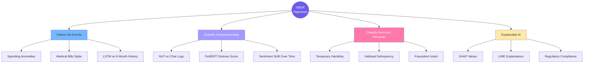

---

## 3. Tech Stack

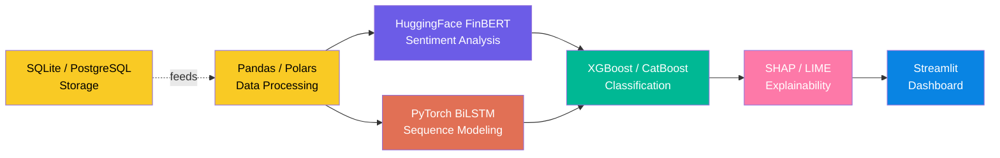

**Hardware:** Mac Pro M3 Pro | 24GB Unified Memory | PyTorch `mps` device

---

## 4. Phase A — Data Preparation

### 4a. Data Sources

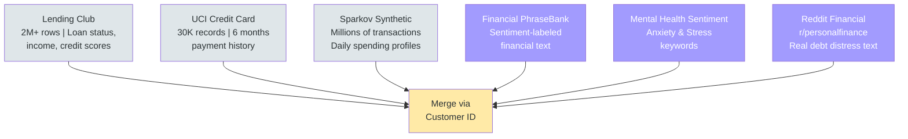

### 4b. Merge Strategy (The Secret Sauce)

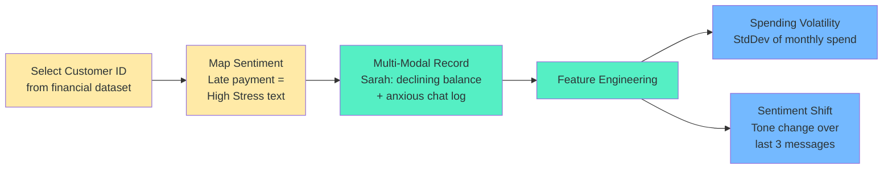

---

## 5. Phase B — The Multi-Modal Pipeline

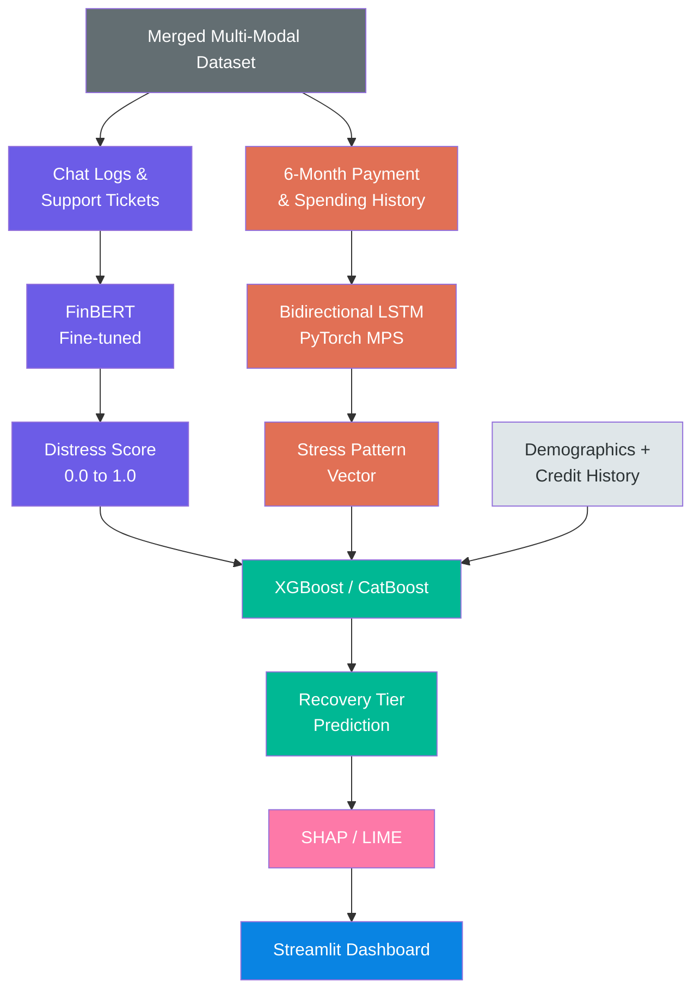

> **Branch 1 (Purple):** NLP — FinBERT processes chat logs into a Distress Score
> **Branch 2 (Orange):** DL — BiLSTM detects hidden stress patterns in spending sequences
> **Branch 3 (Green):** ML — XGBoost combines both outputs + demographics into a Recovery Tier

---

## 6. Phase C — The 4 Action Tiers

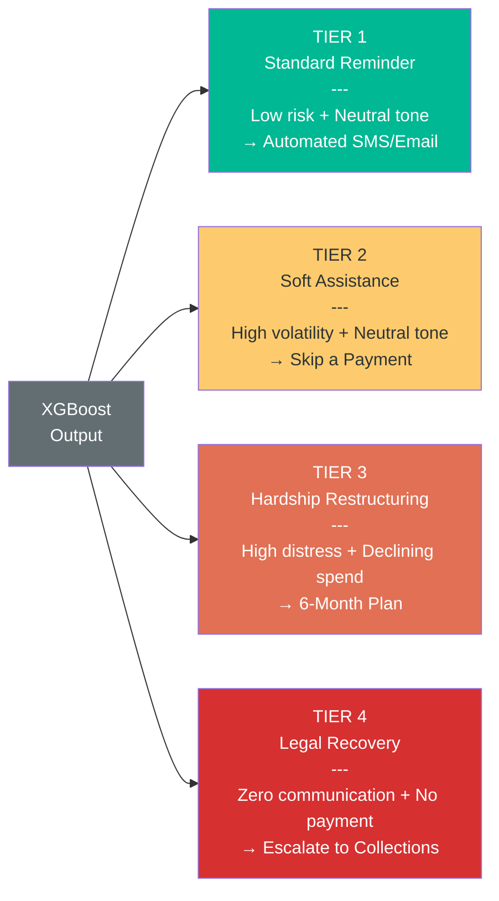

---

## 7. Customer Persona Classification

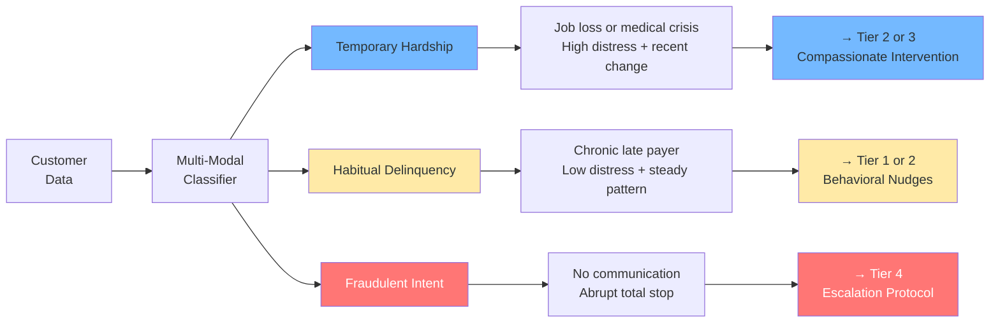

---

## 8. Data Flow — Raw to Decision

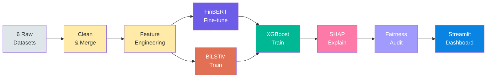

---

## 9. Explainability & Compliance

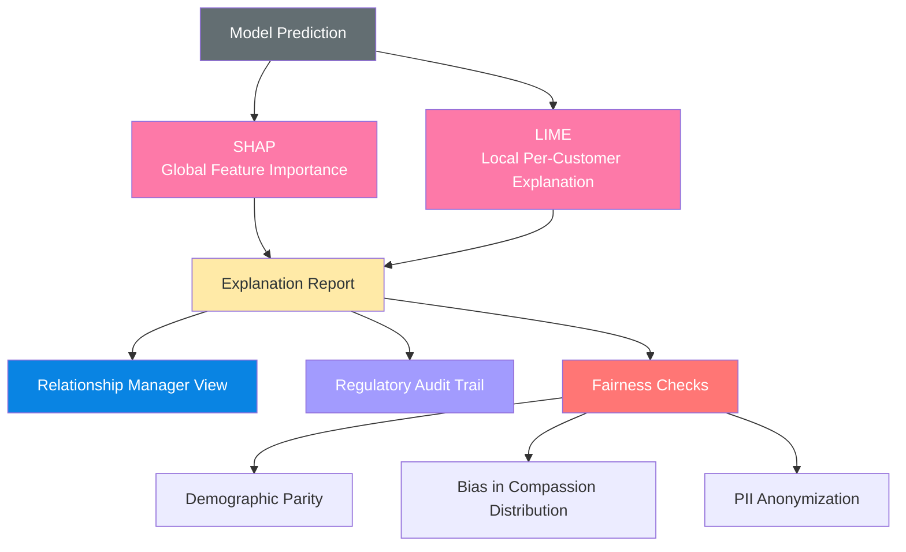

> **RM Dashboard Example:** *"This customer was placed in Tier 3 because their Distress Score rose 40% and payments dropped 3 consecutive months."*

---

## 10. Business Impact

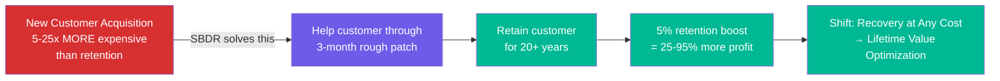

---

## 11. Project Execution Timeline

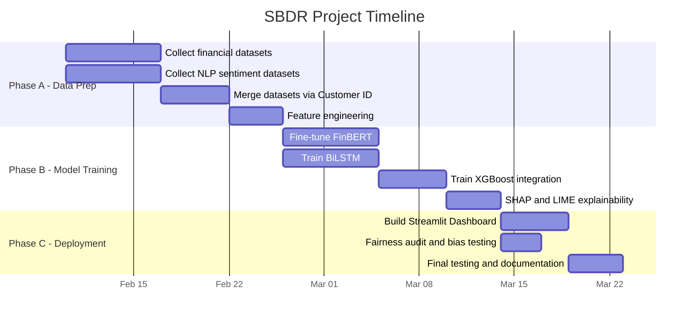

---

## 12. Complete Architecture — Single View

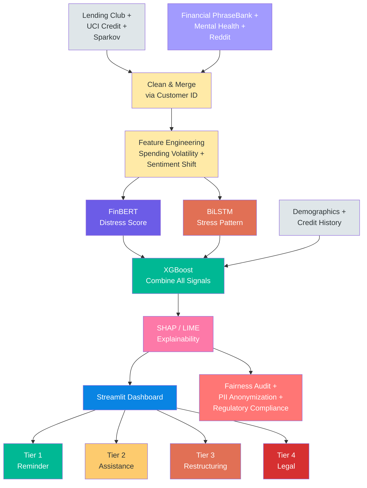

---

## Color Key

| Color | Meaning |
|-------|---------|
| Grey | Raw Data / Input |
| Yellow | Data Preparation / Feature Engineering |
| Purple | NLP (FinBERT) |
| Orange | Deep Learning (BiLSTM) |
| Green | ML (XGBoost) / Positive Outcomes |
| Pink | Explainability (SHAP/LIME) |
| Blue | Deployment (Streamlit) |
| Red | Risk / Legal / Guardrails |

